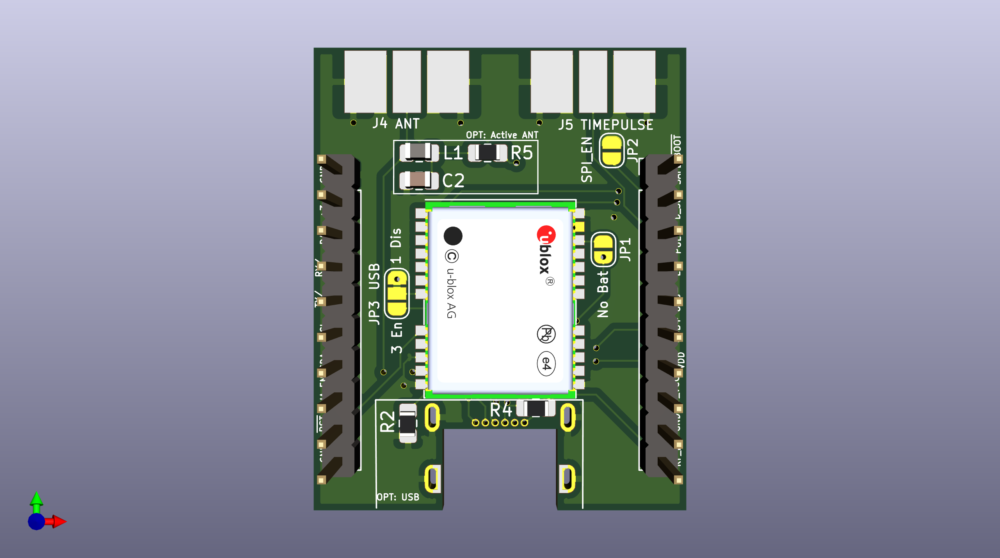
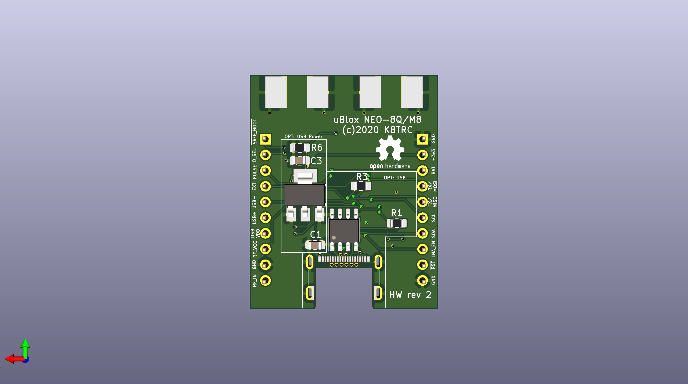

# Breakout board for uBlock NEO-8 series. (NEO-8Q and NEO-M8)

This is a board designed to breakout pins on the uBlox NEO-8 GPS modules.
 - Solderless breadboard compatible
 - Edge-launch SMA for antenna and time pulse
 - Solder bridge to select UART or SPI
 - Solder bridge to enable/disable battery backup
 - Optional components for active (powered) antenna
 - Optional components for USB-C data
 - Optional components for USB-C power

## License
This design is licensed as [Open Source Hardware](http://www.oshwa.org/)

## Revision history
### Rev. 1
Initial revision of the board.

### Rev. 2
 - Add solder bridge documentation to the schematic
 - Add header pin labels to the PCB on the front and back
 - Tuning of solder mask markings for readability
 - Addition of solder mask markings to easily demarcate the optional sections
